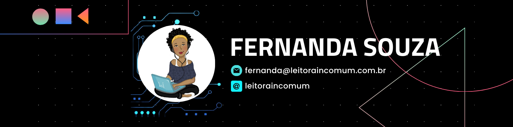

👷🏾‍♀️🎲 Engenheira de Dados. 
* *Equidade, não igualdade.* 
*🎙 Hoster Podcast: [**Criando Monstrinhos**](https://anchor.fm/criando-monstrinhos/)
*📚 Leio: códigos, livros e desabafos.
---
<section>

  
<b> About me (EN version)...</b></i> 

👷🏾‍♀️🎲‍ Data Engineer.
* *Equity, not equality.* 
* Hoster Podcast: [**Criando Monstrinhos**](https://anchor.fm/criando-monstrinhos/)
* I read: codes, books and outbursts.
  
</section>

<b>GitHub Stats / Estatísticas GitHub</b></i> 

</section>
